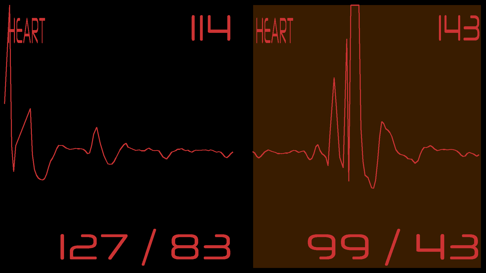

# Odysseus LARP patient monitor

Odysseus larp patient monitor is the software for a patient monitor that was
used as a prop in a sci-fi medbay on board of a spaceship. Odysseus was a
live action roleplaying game organized in Helsinki, Finland, in 2019 and 2024.
More information on the game is available at

    https://www.odysseuslarp.com/

The Odysseus larp patient monitor uses WildDivine biofeedback sensors
sold for meditation and stress resilience purposes, and uses the liblightstone
library developed by Kyle Machulis of Nonpolynomial Labs (nonpolynomial.com).
It can view patient status for up to 4 patients and automatically sets up split
screens according to the number of lightstone devices connected at startup time.

This code is written as a hobby for gaming prop purposes, and is provided as-is
and should be used only on one's own responsibility. It is neither optimized nor
modern, and this is by design.

## Required packages (Ubuntu)

The Odysseus larp patient monitor uses the SDL 2 library for graphics, sounds
and threading as this was a convenient, easy choice that takes care of most
needs. In addition, it utilizes libusb-1.0.0 through liblightstone. Libusb-1.0.0
is available in Ubuntu repositories, liblightstone has to be downloaded and compiled
separately.

The software can also be compiled on Windows, but right now there are no detailed
instructions for it.

The full list of Ubuntu packages that need to be installed is:

    g++
    cmake
    libusb-1.0-0.dev
    libsdl2-dev
    libsdl2-image-dev
    libsdl2-ttf-dev
    libsdl2-gfx-dev

## User interface

By design, the patient monitor has no visible UI, and for the Odysseus LARP,
only displays and the lightstone sensors were visible to the players - computers
and keyboards were hidden from view.

However, when starting the system, the view can be configured by pressing these
keys:

    1       Swap top left and top right views
    2       Swap top right and bottom left views
    3       Swap bottom left and bottom right views
    4       Decrease DATA_WIDTH (more data on screen, slower curve)
    5       Increase DATA WIDTH (less data on screen, faster curve)
    6, a, b Toggle audio
    0, -    Decrease line width
    +       Increase line width

## License

Copyright (C) 2025 by Jonni Lehtiranta <jonni.lehtiranta@gmail.com>

Permission to use, copy, modify, and/or distribute this software for any purpose with or without fee is hereby granted.

THE SOFTWARE IS PROVIDED "AS IS" AND THE AUTHOR DISCLAIMS ALL WARRANTIES WITH REGARD TO THIS SOFTWARE INCLUDING ALL IMPLIED WARRANTIES OF MERCHANTABILITY AND FITNESS. IN NO EVENT SHALL THE AUTHOR BE LIABLE FOR ANY SPECIAL, DIRECT, INDIRECT, OR CONSEQUENTIAL DAMAGES OR ANY DAMAGES WHATSOEVER RESULTING FROM LOSS OF USE, DATA OR PROFITS, WHETHER IN AN ACTION OF CONTRACT, NEGLIGENCE OR OTHER TORTIOUS ACTION, ARISING OUT OF OR IN CONNECTION WITH THE USE OR PERFORMANCE OF THIS SOFTWARE.
